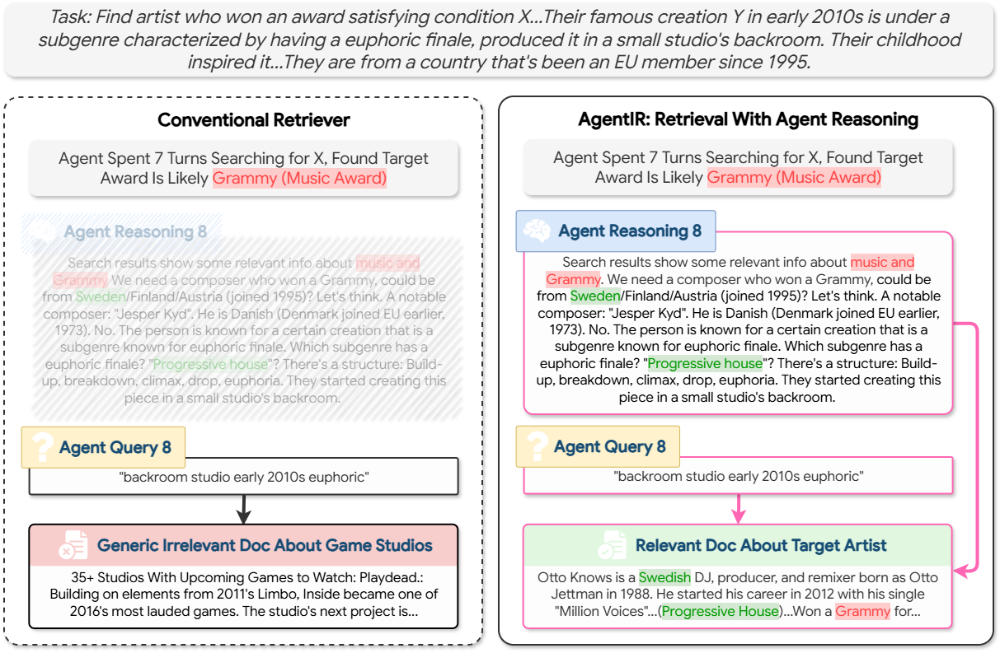
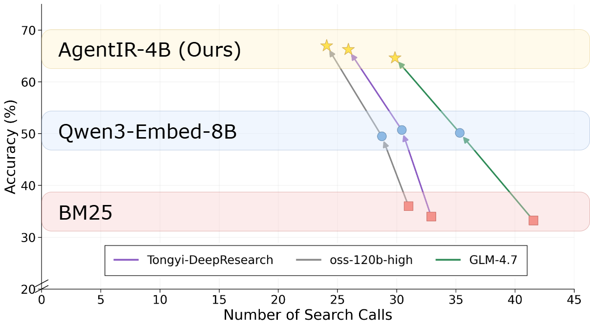

# AgentIR

| [📄Paper](https://arxiv.org/abs/2603.04384) | [🏠Project Page](https://texttron.github.io/AgentIR/) | [🤗Model](https://huggingface.co/Tevatron/AgentIR-4B) | [🤗Data](https://huggingface.co/datasets/Tevatron/AgentIR-data) |

AgentIR is a retriever specialized for Deep Research agents. Unlike conventional retrievers that proces queries unaware of the agent, AgentIR explicitly leverages the agent's reasoning trace by jointly embedding it alongside the query. 

<p align="center">
  
</p>


When employed for end-to-end Deep Research, AgentIR brings substantial effectiveness and efficiency gains for agents, improving agent accuracy while reducing the number of problem-solving iterations.

<p align="center">
  
</p>
> Evaluation results on [BrowseComp-Plus](https://github.com/texttron/BrowseComp-Plus).

## 🔍 Quick Usage

For a quick start with only minimal dependencies (`torch` and `transformers`):

```
import torch
from transformers import AutoModel, AutoTokenizer

MODEL = "Tevatron/AgentIR-4B"
PREFIX = "Instruct: Given a user's reasoning followed by a web search query, retrieve relevant passages that answer the query while incorporating the user's reasoning\nQuery:"

QUERY = """Reasoning: Search results show some relevant info about music and Grammy. We need a composer who won a Grammy, could be from Sweden/Finland/Austria (joined 1995)? The person is known for a certain creation that is a subgenre known for euphoric finale. Which subgenre has a euphoric finale? "Progressive house"? There's a structure: Build-up, breakdown, climax, drop, euphoria. They started creating this piece in a small studio's backroom.

Query: "backroom" "studio" "early 2010s" "euphoric"
"""
DOCS = [
    "35+ Studios With Upcoming Games to Watch: Turtle Rock Studios\n\nMaking its name on the classic Left 4 Dead series of games, Turtle Rock Studios is working on an all-new co-op game called Back 4 Blood that sees you fighting through a zombie apocalypse. Sound familiar? Announced in early 2019 and being published",
    "name: Otto Knows\nimage_upright: 1.25\nbirth_name: Otto Jettman\nbirth_date: 6 05 1989\nbirth_place: Stockholm, Sweden\ngenre: Electro house, house, progressive house\noccupation: DJ, music producer, remixer\n\nOtto Jettman (born 6 May 1989), better known by his stage name Otto Knows is a Swedish DJ, producer and remixer who has had a number of hits in Sweden, Belgium and the Netherlands"
]


def pool_last_token(hidden, mask):
    if mask[:, -1].sum() == mask.shape[0]:
        return hidden[:, -1]
    idx = mask.sum(dim=1) - 1
    return hidden[torch.arange(hidden.shape[0], device=hidden.device), idx]


def embed(texts, model, tokenizer, device, is_query=False):
    batch = tokenizer(
        [PREFIX + t if is_query else t for t in texts],
        padding=True,
        truncation=True,
        max_length=8192,
        return_tensors="pt",
    )
    batch = {k: v.to(device) for k, v in batch.items()}
    with torch.no_grad():
        hidden = model(**batch, return_dict=True).last_hidden_state
        reps = pool_last_token(hidden, batch["attention_mask"])
        return torch.nn.functional.normalize(reps, p=2, dim=-1).cpu()

model = AutoModel.from_pretrained(MODEL, torch_dtype=torch.float16, device_map="auto")
device = model.device
tokenizer = AutoTokenizer.from_pretrained(MODEL, padding_side="left")

q = embed([QUERY], model, tokenizer, device, is_query=True)[0]
docs = embed(DOCS, model, tokenizer, device)
for doc, vec in zip(DOCS, docs):
    print(f"{torch.dot(q, vec).item():.6f}  {doc}")
```

## 💾 Installation

To reproduce the end-to-end Deep Research results and train AgentIR, you can install this project with [uv](https://docs.astral.sh/uv/getting-started/installation/).

Installing `uv` itself:
```
curl -LsSf https://astral.sh/uv/install.sh | sh
```

Then run:
```
uv sync
source .venv/bin/activate
```

## ✨ Run with Agents

To run agents with AgentIR, please see [Evaluation](evaluation/).

## 🛠️ Training

To train AgentIR, please see [Training](training/).

## Contact

If you have any questions or suggestions, please contact us at:
- Zijian Chen: [s42chen@uwaterloo.ca](mailto:s42chen@uwaterloo.ca)
- Xueguang Ma: [x93ma@uwaterloo.ca](mailto:x93ma@uwaterloo.ca)
- Shengyao Zhuang: [s.zhuang@uq.edu.au](mailto:s.zhuang@uq.edu.au)

## Citation

If you find this work useful, please cite:
```
@article{chen2026AgentIR,
      title={AgentIR: Reasoning-Aware Retrieval for Deep Research Agents}, 
      author={Zijian Chen and Xueguang Ma and Shengyao Zhuang and Jimmy Lin and Akari Asai and Victor Zhong},
      year={2026},
      journal={arXiv preprint arXiv:2603.04384}
}
```